# Week 1 homework

## Question 1. Google Cloud SDK

Install Google Cloud SDK. What's the version you have?

To get the version, run gcloud --version

```bash
    gcloud --version
```

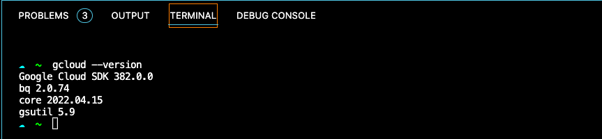

## Question 2. Terraform

Now install terraform and go to the terraform directory (week_1_basics_n_setup/1_terraform_gcp/terraform)

```bash
    terraform
```

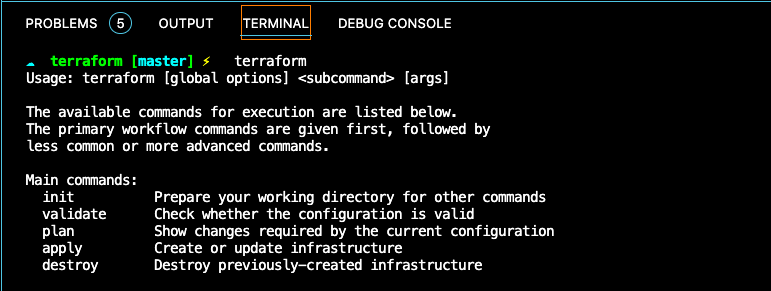

After that, run

terraform init
terraform plan
terraform apply
Apply the plan and copy the output (after running apply) to the form.

It should be the entire output - from the moment you typed terraform init to the very end.

```bash
    terraform init
```

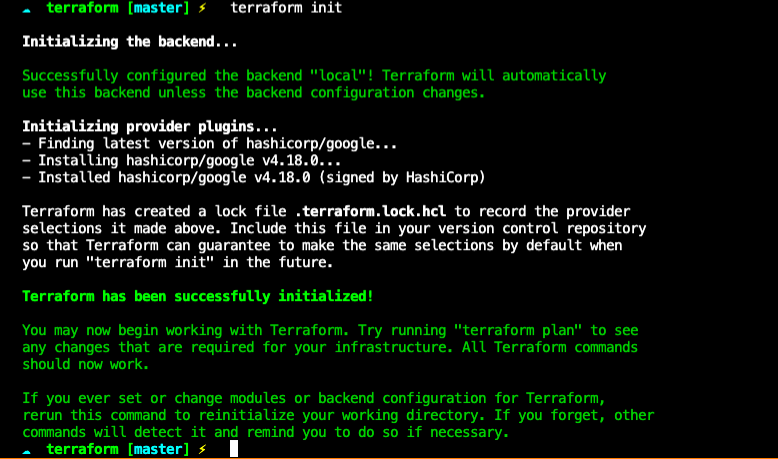

```bash
    terraform plan
```

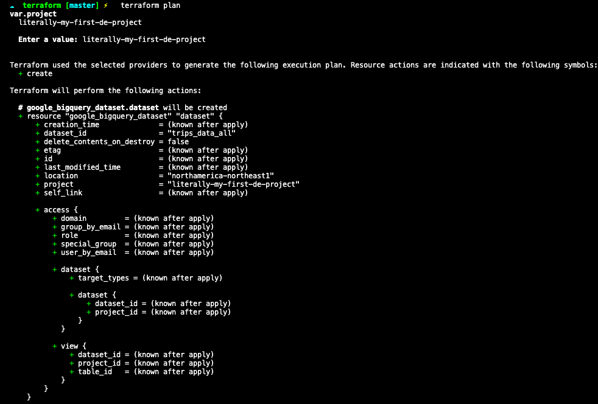


```bash
    terraform apply
```

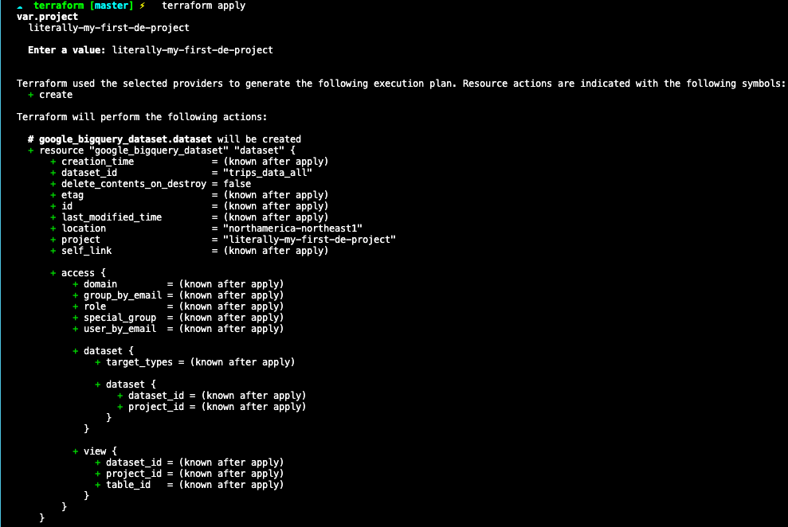

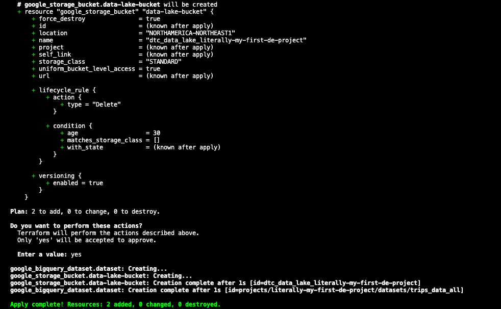

```bash
    terraform destroy
```


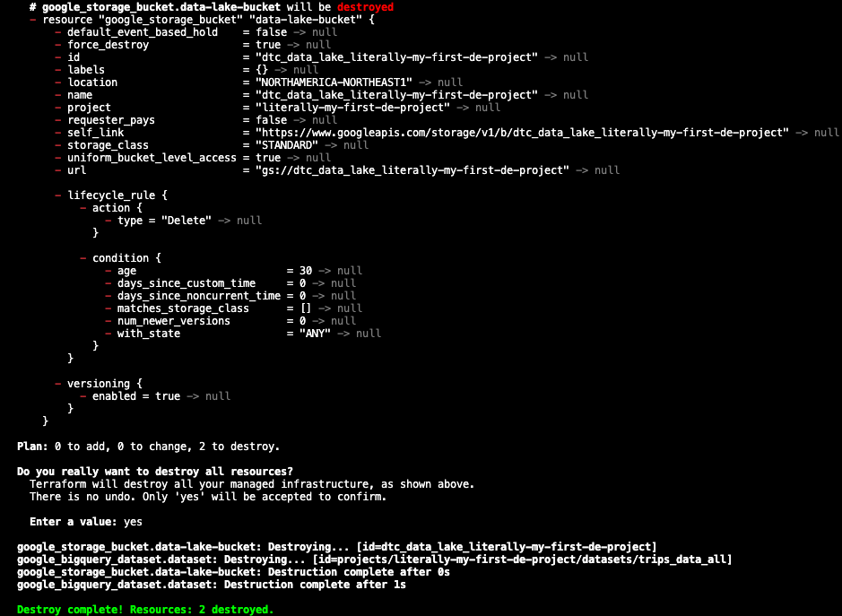

## Question 3. Count records

How many taxi trips were there on January 15?

```sql

SELECT COUNT(EXTRACT(day FROM tpep_pickup_datetime)) AS jan_15_trips
FROM yellow_taxi_data
WHERE extract(day FROM tpep_pickup_datetime) = 15
;
```

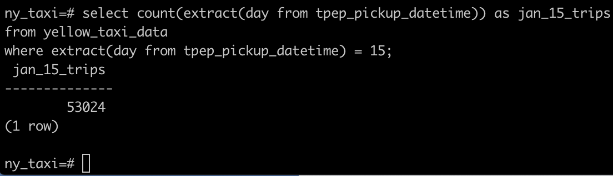

## Question 4

### Largest tip for each day

```sql

SELECT 
	extract(day FROM tpep_pickup_datetime) AS day, 
	MAX(tip_amount) As max_daily_tip
FROM 
	yellow_taxi_data
GROUP BY 
	extract(day FROM tpep_pickup_datetime)
ORDER BY 
	extract(day FROM tpep_pickup_datetime)
;
```

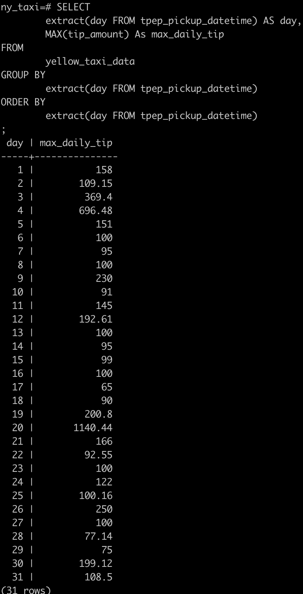


### Largest tip

```sql

SELECT 
	extract(day FROM tpep_pickup_datetime) AS day, 
	MAX(tip_amount) As max_daily_tip
FROM 
	yellow_taxi_data
GROUP BY 
	extract(day FROM tpep_pickup_datetime)
ORDER BY 
	MAX(tip_amount) DESC
LIMIT 1
;
```

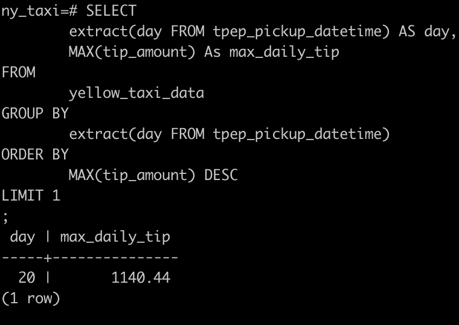

## Question 5. Most popular destination

What was the most popular destination for passengers picked up in central park on January 14?

Use the pick up time for your calculations.

Enter the zone name (not id). If the zone name is unknown (missing), write "Unknown".

```sql

SELECT "pu_zone"."Zone" AS PU_ZONE, "do_zone"."Zone", COUNT("do_zone"."Zone") AS DO_ZONE_COUNT
FROM yellow_taxi_data
JOIN taxi_zone_lookup pu_zone ON ("yellow_taxi_data"."PULocationID"="pu_zone"."LocationID")
JOIN taxi_zone_lookup do_zone ON ("yellow_taxi_data"."DOLocationID"="do_zone"."LocationID")
WHERE 
	extract(day FROM tpep_pickup_datetime) = 14
AND
	"pu_zone"."LocationID" = (SELECT "LocationID" FROM taxi_zone_lookup WHERE "Zone" = '"Central Park"')
GROUP BY
	"pu_zone"."Zone", "do_zone"."Zone"
ORDER BY COUNT("do_zone"."Zone") DESC
LIMIT 5
;
```

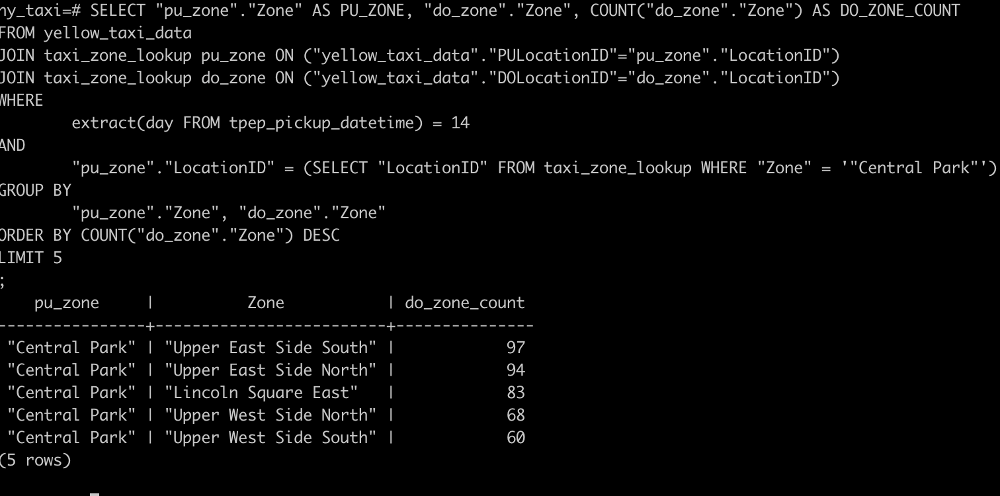

## Question 6. Most expensive locations

What's the pickup-dropoff pair with the largest average price for a ride (calculated based on total_amount)?

Enter two zone names separated by a slash

For example:

"Jamaica Bay / Clinton East"

If any of the zone names are unknown (missing), write "Unknown". For example, "Unknown / Clinton East".

```sql

SELECT CONCAT(
    COALESCE("pu_zone"."Zone", 'unknown'), 
    '/', 
    COALESCE("do_zone"."Zone", 'unknown')
    ) AS PU_DO_COMBO, 
    AVG(total_amount) AS AVG_TRIP_PRICE
FROM yellow_taxi_data
JOIN taxi_zone_lookup pu_zone ON ("yellow_taxi_data"."PULocationID"="pu_zone"."LocationID")
JOIN taxi_zone_lookup do_zone ON ("yellow_taxi_data"."DOLocationID"="do_zone"."LocationID")
GROUP BY
	CONCAT(COALESCE("pu_zone"."Zone", 'unknown'), '/', COALESCE("do_zone"."Zone", 'unknown'))
ORDER BY AVG(total_amount) DESC
LIMIT 5
;
```

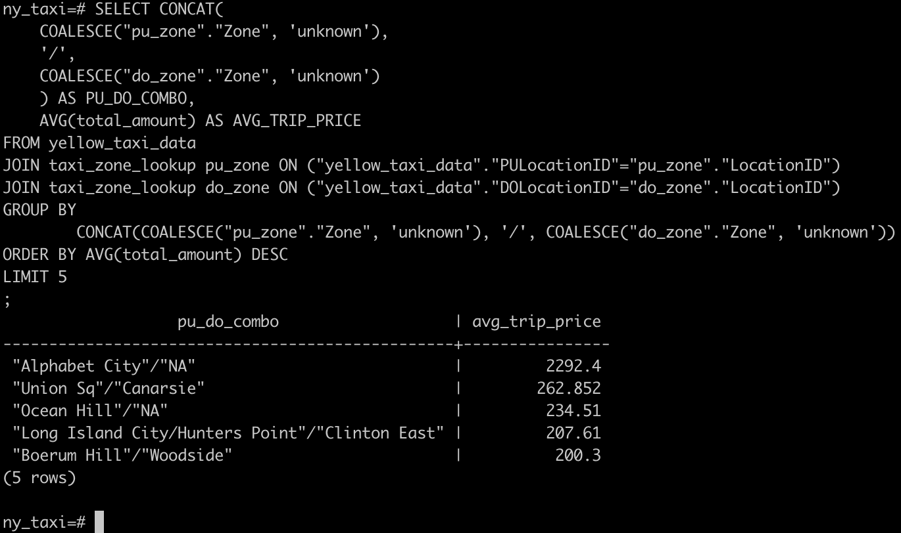