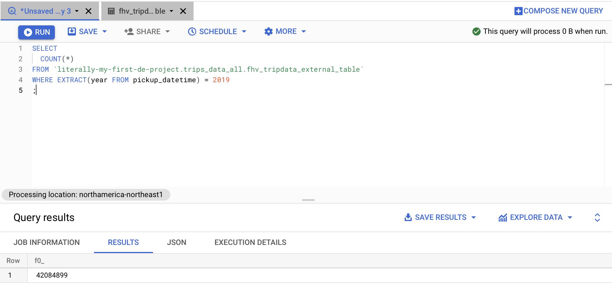
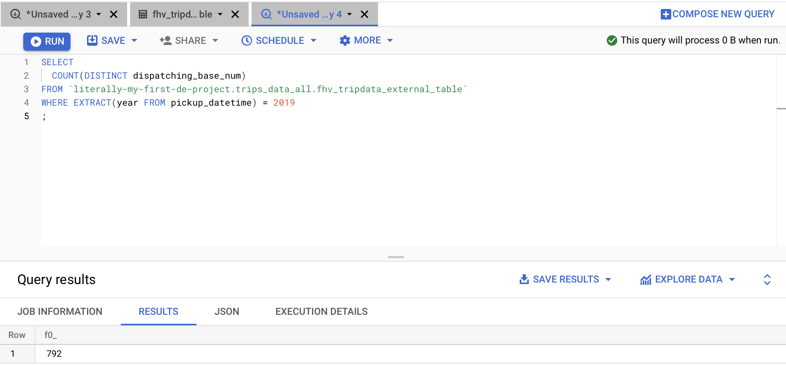
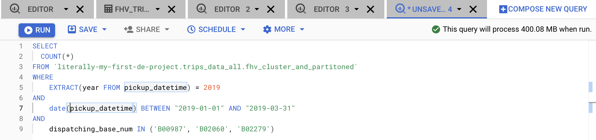

# Week 3 Homework

- [Week 3 Homework](#week-3-homework)
  - [Question 1](#question-1)
  - [Question 2](#question-2)
  - [Question 3](#question-3)
  - [Question 4](#question-4)
  - [Question 5](#question-5)
  - [Question 6](#question-6)
  - [Question 7](#question-7)

## Question 1

What is count for fhv vehicles data for year 2019?

```sql

SELECT 
  COUNT(*) 
FROM `literally-my-first-de-project.trips_data_all.fhv_tripdata_external_table` 
WHERE EXTRACT(year FROM pickup_datetime) = 2019
;
```



## Question 2

How many distinct dispatching_base_num we have in fhv for 2019?

```sql
SELECT 
  COUNT(DISTINCT dispatching_base_num)
FROM `literally-my-first-de-project.trips_data_all.fhv_tripdata_external_table` 
WHERE EXTRACT(year FROM pickup_datetime) = 2019
;
```


## Question 3

Best strategy to optimise if query always filter by dropoff_datetime and order by dispatching_base_num?

Partition by dropoff_datetime and cluster by dispatching_base_num.  Clustering on dispatching_base_num neccessary becasue a string column cannot be partititoned.

## Question 4

What is the count, estimated and actual data processed for query which counts trip between 2019/01/01 and 2019/03/31 for dispatching_base_num B00987, B02060, B02279?

Create a table with optimized clustering and partitioning, and run a count(*). Estimated data processed can be found in top right corner and actual data processed can be found after the query is executed.

COUNT = 26560
Approx bytes processed = 400.08 MB
Actual bytes processed = 133.27 MB



```sql

CREATE TABLE `literally-my-first-de-project.trips_data_all.fhv_cluster_and_partitoned`
PARTITION BY DATE(pickup_datetime)
CLUSTER BY (dispatching_base_num)
AS
SELECT * FROM `literally-my-first-de-project.trips_data_all.fhv_tripdata_external_table`;

```

```sql

SELECT 
  COUNT(*)
FROM `literally-my-first-de-project.trips_data_all.fhv_cluster_and_partitoned` 
WHERE 
    EXTRACT(year FROM pickup_datetime) = 2019
AND
    DATE(pickup_datetime) BETWEEN "2019-01-01" AND "2019-03-31"
AND 
    dispatching_base_num IN ('B00987', 'B02060', 'B02279')
;

```

## Question 5

What will be the best partitioning or clustering strategy when filtering on dispatching_base_num and SR_Flag
Review partitioning and clustering video?

Partition on SR_Flag (integer) and cluster on dispatching_base_num (string).  The answer in the solutions video is to cluster on both but for some reason his table has SR_Flag as a string.  I'm going with my answer because I think partitioning and clustering work well together.

## Question 6

What improvements can be seen by partitioning and clustering for data size less than 1 GB?

From the BQ documentation

Prefer clustering over partitioning under the following circumstances:

- Partitioning results in a small amount of data per partition (approximately less than 1 GB).
  
- Partitioning results in a large number of partitions beyond the limits on partitioned tables.

- Partitioning results in your mutation operations modifying most partitions in the table frequently (for example, every few minutes).

So you will not see performance improvements with partition of less than 1 GB and may actually see a performance decrease.

## Question 7

In which format does BigQuery save data?

BQ stores data in a columner format called capacitor.
